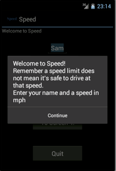
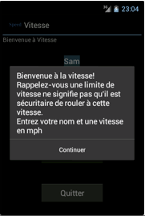
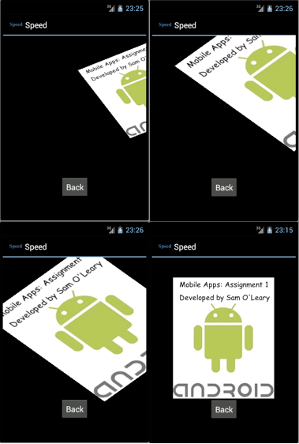

Android-Speed
=============

Mobile Applications Assignment 1: Speed

This Android App has been designed to give the user an idea of what it’s like to hit a solid object in a car by comparing it to a distance a person would free-fall. 
For example driving into wall at 50km/h is equivalent to free-falling 9 meters onto a hard surface.

Features and Components included:

- Use of multiple different Layouts
- TextView, EditText and Button components
- Custom App Icon available in 3 different resolutions
- Data Persistence: User information is saved using Shared Preferences
- This App is also available in French
- App rearranges its layout dynamically to adjust to horizontal and vertical orientations
- Uses Alerts
- Uses an Animation to display App Information

